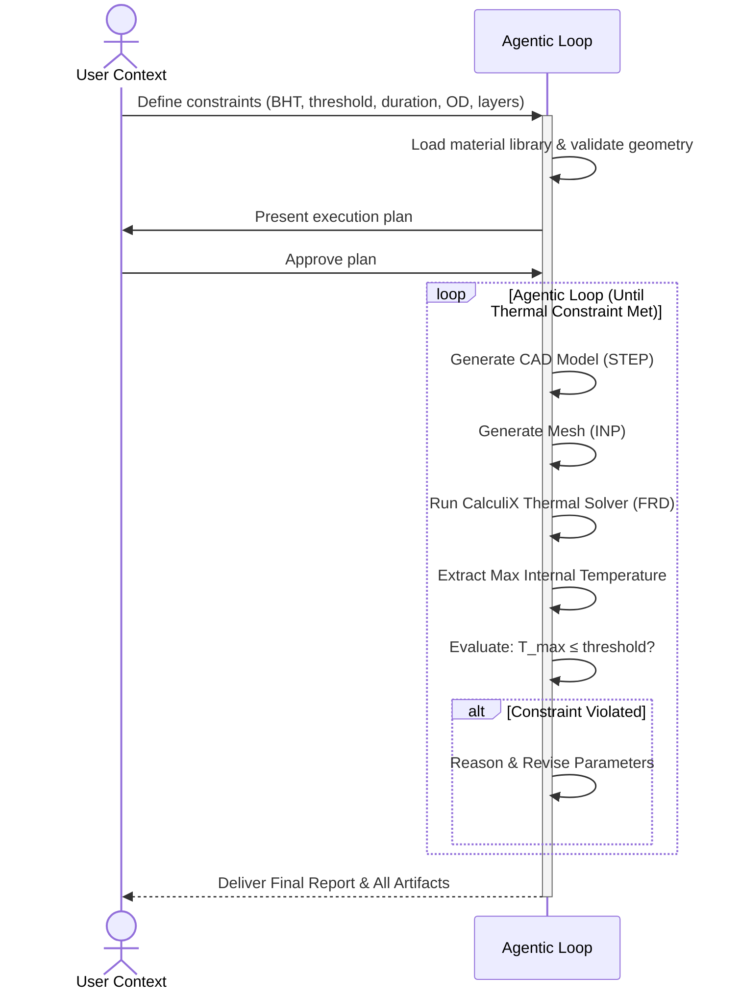

# COSMO-Agent: Thermal CAD-CAE Optimization Loop

> **Purpose:** Instruct the Antigravity IDE agent to execute the COSMO-Agent closed-loop thermal optimization workflow inside the `cosmo/` directory. The agent uses existing Python scripts as tools while autonomously reasoning about parameter adjustments at each iteration.

---

## User-Provided Parameters

Before executing, collect the following parameters from the user. **All parameters are required unless marked optional.**

| Parameter | Description | Example |
|---|---|---|
| `BHT` | Bottomhole Temperature — external boundary condition (°C) | `150.0` |
| `threshold` | Target maximum internal temperature (°C) — the convergence goal | `85.0` |
| `time_seconds` | Exposure duration for the thermal simulation (seconds) | `3600` |
| `OD` | Outer Diameter of the casing (mm) | `43.0` |
| `length` | Casing length (mm) | `100.0` |
| `initial_layers` | Initial layer stack from outermost to innermost — each layer has `name`, `material`, and `thickness` (mm) | See example below |
| `material_library` *(optional)* | Path to a custom material library JSON file. Defaults to `cosmo/material_library.json` | `cosmo/material_library.json` |

### Example Initial Layer Stack

```json
[
  {"name": "Outer", "material": "Titanium", "thickness": 3.0},
  {"name": "Insulation", "material": "Microporous", "thickness": 5.0},
  {"name": "Chassis", "material": "PEEK", "thickness": 3.0}
]
```

---

## Pre-Execution Plan

**Before starting the loop, you MUST:**

1. **Summarize** all user-provided parameters in a clear table.
2. **Load** the material library (`cosmo/material_library.json` or user-specified path) and confirm available materials.
3. **Validate** the initial geometry: ensure `OD - 2 × Σ(layer thicknesses) ≥ 10 mm` (minimum internal diameter for electronics chassis).
4. **Present** the execution plan to the user:
   - Initial parameters and layer stack
   - Convergence target (max internal temperature ≤ `threshold`)
   - Available materials in the library
   - Estimated execution steps
5. **Wait for explicit user approval** before proceeding to the optimization loop.

---

## Agentic Loop Workflow

Execute the following closed-loop cycle. The agent iterates **autonomously until the thermal constraint is satisfied** (max internal temperature ≤ `threshold`).

```
┌─────────────────────────────────────────────────────────────┐
│                    AGENTIC LOOP                             │
│                                                             │
│   ┌──────────────┐                                          │
│   │ 1. CAD GEN   │ → Generate STEP file via cad_generator  │
│   └──────┬───────┘                                          │
│          ▼                                                  │
│   ┌──────────────┐                                          │
│   │ 2. MESHING   │ → Generate FEA mesh via mesh_generator   │
│   └──────┬───────┘                                          │
│          ▼                                                  │
│   ┌──────────────┐                                          │
│   │ 3. SOLVE     │ → Run CalculiX via solver_interface      │
│   └──────┬───────┘                                          │
│          ▼                                                  │
│   ┌──────────────┐                                          │
│   │ 4. EXTRACT   │ → Extract max temp via result_extractor  │
│   └──────┬───────┘                                          │
│          ▼                                                  │
│   ┌──────────────┐    ┌─────────────────────────────────┐   │
│   │ 5. EVALUATE  │───►│ Constraint Met? (T ≤ threshold) │   │
│   └──────────────┘    └──────────┬──────────┬───────────┘   │
│                              YES │          │ NO            │
│                                  ▼          ▼               │
│                          ┌──────────┐ ┌──────────────┐      │
│                          │ CONVERGE │ │ 6. REASON &  │      │
│                          │ & REPORT │ │ REVISE PARAMS│──┐   │
│                          └──────────┘ └──────────────┘  │   │
│                                                         │   │
│                              ┌───────────────────────┐  │   │
│                              │ Loop back to Step 1   │◄─┘   │
│                              └───────────────────────┘      │
└─────────────────────────────────────────────────────────────┘
```

### Step-by-Step Execution

For each iteration `t`, perform these steps **in order**:

#### Step 1 — CAD Generation
- Call `cosmo/cad_generator.py :: generate_casing(od, length, layers, output_file)`
- Output: `casing_iter{t}.step`

#### Step 2 — Mesh Generation
- Call `cosmo/mesh_generator.py :: generate_mesh(step_file, inp_file, layers)`
- Output: `casing_iter{t}.inp`

#### Step 3 — Solver Execution
- Call `cosmo/solver_interface.py :: setup_and_run_calculix(inp_file, layers, od_mm, bht, time_seconds)`
- Output: `casing_iter{t}.frd` + solver logs

#### Step 4 — Result Extraction
- Call `cosmo/result_extractor.py :: extract_max_internal_temperature(frd_file, target_time, r_inner)`
- Calculate `r_inner = (OD / 2) - Σ(layer thicknesses)`
- Output: `max_temp` (°C) — the maximum temperature at the innermost surface

#### Step 5 — Constraint Evaluation
- Check: `max_temp ≤ threshold`
- If **satisfied** → proceed to **Convergence & Deliverables**
- If **violated** → proceed to **Step 6**

#### Step 6 — Reasoning & Parameter Revision

> **This is the core agentic intelligence step.** You are NOT running a hardcoded optimization script. You MUST reason about the physics and propose intelligent parameter changes.

**Reasoning checklist:**
1. **Analyze** the temperature overshoot: how far above the threshold is the result?
2. **Diagnose** the thermal path: which layer is the bottleneck? Is the insulation insufficient? Is the thermal mass too low?
3. **Consider** available materials from the library and their thermal properties (conductivity, specific heat, density).
4. **Propose** specific changes — any combination of:
   - Changing material for one or more layers
   - Adjusting layer thicknesses
   - Adding new layers (e.g., vacuum gap, thermal mass buffer)
   - Increasing OD (if thickness budget is exhausted)
   - Removing redundant layers
5. **Validate** proposed geometry: `OD - 2 × Σ(new thicknesses) ≥ 10 mm`
6. **Document** your reasoning clearly before executing the next iteration.

**Critical rule:** Each iteration MUST include a written reasoning block that explains:
- Current state (temperature result, overshoot percentage)
- Diagnosis (why the design failed)
- Proposed changes (what you're changing and why)
- Expected effect (what you expect the changes to achieve)

---

## Failure Handling

If any step in the loop fails (CAD generation error, meshing failure, solver crash, extraction error):

1. **STOP** the loop immediately.
2. **Report** the error with full diagnostic details:
   - Which step failed
   - The exact error message
   - The parameters that caused the failure
   - Relevant log output
3. **Ask the user** how to proceed before continuing.

**Do NOT** silently skip failed iterations or attempt automatic recovery.

---

## Safety Cap

- There is **no hard iteration limit**. The agent should iterate until convergence.
- However, if the total elapsed wall-clock time exceeds **2 hours**, the agent MUST:
  1. **Pause** the loop
  2. **Report** progress so far (best candidate, iteration count, current state)
  3. **Ask the user** whether to continue or stop
  4. If the user approves continuation, reset the timer and resume

---

## Convergence & Deliverables

When the thermal constraint is satisfied (`max_temp ≤ threshold`), produce the following deliverables inside `cosmo/results/`:

### 1. Optimized CAD Files
- Save all `.step` files from every iteration: `cosmo/results/iteration_XX/casing_iterXX.step`

### 2. Comparison Table (Markdown)
- Generate `cosmo/results/comparison_table.md` using `cosmo/results_compiler.py :: compile_results()`
- Table columns: Iteration, OD, Layers (material + thickness), Max Temperature, Constraint Status

### 3. Temperature Distribution Plots
- Generate plots using `cosmo/plot_results.py :: plot_all_results()`
- Save as PNG/SVG in `cosmo/results/`
- Show temperature vs. time or radial position for each iteration

### 4. 3D Thermal Animation (Final Design Only)
- Run `cosmo/thermal_animator.py :: animate_results()` on the converged iteration
- Output: `cosmo/results/thermal_anim_final.mp4`

### 5. Optimization Log (JSON)
- Save `cosmo/results/optimization_log.json` with structured data for every iteration:
  ```json
  {
    "iterations": [
      {
        "iteration": 1,
        "config": {"od": 43.0, "layers": [...]},
        "result": {"max_temp": 120.5},
        "constraints": {"thermal": {"threshold": 85.0, "satisfied": false}},
        "reasoning": "Temperature 120.5°C is 41.8% above threshold...",
        "proposed_next": {"od": 50.0, "layers": [...]}
      }
    ]
  }
  ```

### 6. Final Design Report (Markdown)
- Generate `cosmo/results/final_report.md` containing:
  - **Summary**: Converged design parameters, total iterations, total runtime
  - **Optimal Layer Stack**: Final material selection and thicknesses with rationale
  - **Thermal Performance**: Max internal temperature achieved, margin below threshold
  - **Material Recommendation**: Why the selected materials are appropriate (reference `material_library.json` notes and standards)
  - **Iteration History**: Brief summary of each iteration's reasoning and changes
  - **Embedded Visuals**: Links to temperature plots and animation

---

## Working Directory & File References

All execution happens inside the `cosmo/` directory. Key files:

| File | Purpose |
|---|---|
| `cosmo/cad_generator.py` | Generates parametric multi-layer concentric cylinder STEP files using CadQuery |
| `cosmo/mesh_generator.py` | Generates FEA mesh from STEP geometry using Gmsh |
| `cosmo/solver_interface.py` | Sets up boundary conditions and runs CalculiX thermal solver |
| `cosmo/result_extractor.py` | Extracts maximum internal temperature from FRD result files |
| `cosmo/cosmo_runner.py` | Single-iteration runner that chains all four tools |
| `cosmo/material_library.json` | Material thermal properties database (9 materials) |
| `cosmo/plot_results.py` | Generates temperature distribution plots |
| `cosmo/thermal_animator.py` | Creates 3D thermal animation videos |
| `cosmo/results_compiler.py` | Compiles iteration results into comparison tables |

---

## Sequence Diagram (Agentic Loop)



---

## Example Invocation

The user might invoke this prompt by saying:

> "Run the COSMO thermal optimization with BHT=150°C, target threshold=85°C, exposure time=3600 seconds, OD=43mm, length=100mm. Start with Titanium outer (3mm), Microporous insulation (5mm), and PEEK chassis (3mm)."

The agent should parse these values, present the plan, and begin the agentic loop upon approval.
