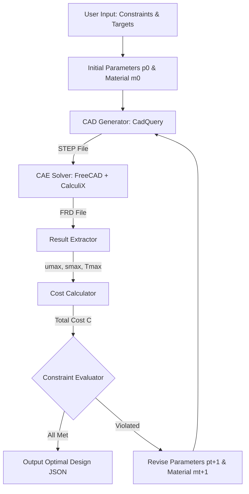

# COSMO-Agent CAD-CAE Orchestration

This skill documents the **Closed-loop Optimization, Simulation, and Modeling Orchestration (COSMO-Agent)** framework based on the *arXiv:2604.05547* research paper [1]. It serves as the **theoretical reference** for the COSMO methodology, covering the general framework architecture, mathematical foundations, and engineering constraints.

> [!IMPORTANT]
> **This skill is a reference document, not an executable instruction.** For the actual runnable workflow, use the prompt file at [cosmo-agent-run.md](file:///c:/Users/ASUS/Desktop/project/antigravity-pertacoustic/.agents/prompts/cosmo-agent-run.md). That prompt implements the **thermal-only** subset of this general framework using the existing Python toolchain in the `cosmo/` directory.

---

## 1. General Framework Architecture

The COSMO-Agent workflow resolves the "CAD-CAE semantic gap" by casting the design-simulate-evaluate cycle into an iterative loop controlled by the agent [1].

> [!NOTE]
> The diagram below shows the **full** COSMO framework (thermal + structural + cost). The current executable prompt (`cosmo-agent-run.md`) implements the **thermal analysis** path only. Structural (stress/displacement) and cost constraints are defined here for future expansion.

---

## 2. Core Tool Orchestration

The framework relies on four modular tools to execute the loop. These are the theoretical interfaces defined by the COSMO-Agent paper [1], mapped to the actual implementation files in `cosmo/`.

### Tool 1: CAD Generator (CadQuery)
*   **Inputs**: Part Category ($c$), Geometric Parameters ($p$) [1].
*   **Outputs**: Executable solid geometry file (STEP format) and geometry metadata (e.g., face anchor points) [1].
*   **Implementation Rule**: Use **CadQuery** to generate parametric designs. The face anchor points are crucial to ensure that loads and constraints remain consistently bound to the correct faces as dimensions shift [1].
*   **Implementation**: [`cosmo/cad_generator.py`](file:///c:/Users/ASUS/Desktop/project/antigravity-pertacoustic/cosmo/cad_generator.py) — generates multi-layer concentric cylinder STEP files.

### Tool 2: CAE Solver (FreeCAD + CalculiX)
*   **Inputs**: Geometry file path (STEP), Material properties (Young's modulus $E$, Poisson's ratio $\nu$, density $\rho$, thermal conductivity $k$, specific heat $c_p$), and Boundary conditions (applied loads, fixed constraints, thermal BCs) [1].
*   **Outputs**: Simulation result file (FRD format) and solver logs [1].
*   **Boundary Mapping Rule**: Anchor points $q$ from geometry metadata are matched to candidate target faces $F_j$ by calculating point-to-face distance:
    $$\text{dist}(q, F_j) \le \varepsilon$$
    Faces within tolerance $\varepsilon$ are selected as load or constraint faces to maintain consistent boundary condition locations [1].
*   **Implementation**:
    *   Meshing: [`cosmo/mesh_generator.py`](file:///c:/Users/ASUS/Desktop/project/antigravity-pertacoustic/cosmo/mesh_generator.py) — Gmsh-based mesh generation.
    *   Solver: [`cosmo/solver_interface.py`](file:///c:/Users/ASUS/Desktop/project/antigravity-pertacoustic/cosmo/solver_interface.py) — CalculiX boundary condition setup and execution.

### Tool 3: Result Extractor
*   **Inputs**: Simulation result file (FRD) [1].
*   **Outputs (Structural)**: Maximum displacement $u_{\text{max}}$ and maximum von Mises stress $\sigma_{\text{max}}$ [1].
*   **Outputs (Thermal)**: Maximum internal temperature $T_{\text{max}}$ at a specified target time and radial position.
*   **Formulas**:
    *   *Maximum Displacement*:
        $$u_{\text{max}} = \max_i \|u_i\|_2$$
    *   *Maximum von Mises stress*:
        $$\sigma_v = \sqrt{\frac{1}{2} \left[ (\sigma_{xx} - \sigma_{yy})^2 + (\sigma_{yy} - \sigma_{zz})^2 + (\sigma_{zz} - \sigma_{xx})^2 \right] + 3(\tau_{xy}^2 + \tau_{yz}^2 + \tau_{zx}^2)}$$
        $$\sigma_{\text{max}} = \max_i \sigma_{v, i}$$
*   **Implementation**: [`cosmo/result_extractor.py`](file:///c:/Users/ASUS/Desktop/project/antigravity-pertacoustic/cosmo/result_extractor.py) — currently extracts max internal temperature from FRD files.

### Tool 4: Cost Calculator
*   **Inputs**: Geometry file path, Material density $\rho(m)$, Unit mass price $\pi(m)$ [1].
*   **Outputs**: Total material cost $C$ [1].
*   **Formula**:
    $$C = \rho(m) \cdot V_{\text{solid}} \cdot \pi(m)$$
*   **Implementation**: Not yet implemented as a standalone script. Cost data can be added to [`cosmo/material_library.json`](file:///c:/Users/ASUS/Desktop/project/antigravity-pertacoustic/cosmo/material_library.json) when needed.

---

## 3. Recommended Free & Open-Source Toolchain

To build a fully automated, cost-free engineering loop, the project uses the following Python-orchestrated open-source tools:

| Stage | Selected Free Tool | Implementation File | Function & Integration |
| :--- | :--- | :--- | :--- |
| **CAD (Geometry)** | **CadQuery** or **Build123d** [2] | [`cad_generator.py`](file:///c:/Users/ASUS/Desktop/project/antigravity-pertacoustic/cosmo/cad_generator.py) | Python-first parametric modeling engine. Generates 3D geometries as STEP files [2]. |
| **Meshing** | **Gmsh** (via Python API) [2] | [`mesh_generator.py`](file:///c:/Users/ASUS/Desktop/project/antigravity-pertacoustic/cosmo/mesh_generator.py) | High-performance 3D finite element mesh generator. Takes STEP geometry and outputs solver-compatible mesh (`.inp`) [2]. |
| **Solver (CAE)** | **CalculiX (ccx)** [3] | [`solver_interface.py`](file:///c:/Users/ASUS/Desktop/project/antigravity-pertacoustic/cosmo/solver_interface.py) | High-performance FE solver for thermal and structural analysis [3]. |
| **Post-Processing** | **ParaView** (via `ccx2paraview`) [2] | [`thermal_animator.py`](file:///c:/Users/ASUS/Desktop/project/antigravity-pertacoustic/cosmo/thermal_animator.py) | 3D visualization and animation of simulation results. |
| **Plotting** | **Matplotlib** | [`plot_results.py`](file:///c:/Users/ASUS/Desktop/project/antigravity-pertacoustic/cosmo/plot_results.py) | Temperature distribution plots and convergence charts. |
| **Orchestrator** | **Python** | [`cosmo_runner.py`](file:///c:/Users/ASUS/Desktop/project/antigravity-pertacoustic/cosmo/cosmo_runner.py) | Single-iteration runner chaining all four tools. |
| **Material Data** | **JSON** | [`material_library.json`](file:///c:/Users/ASUS/Desktop/project/antigravity-pertacoustic/cosmo/material_library.json) | Thermal properties database (9 materials with density, conductivity, specific heat). |

---

## 4. Engineering Constraints (Full Framework)

The full COSMO framework evaluates three coupled engineering constraints at each iteration round $t$. The current thermal-only prompt uses only Constraint 1 (thermal). The structural and cost constraints are defined here for future implementation.

### Constraint 1: Thermal (Currently Implemented)
Maximum internal temperature must not exceed the target threshold:
$$T_{\text{max}}^{(t)} \le T_{\text{threshold}}$$

### Constraint 2: Stiffness (Future)
Maximum displacement must not exceed the stiffness threshold:
$$u_{\text{max}}^{(t)} \le \delta$$

### Constraint 3: Strength (Future)
Maximum equivalent stress must not exceed the material's allowable stress:
$$\sigma_{\text{max}}^{(t)} \le \sigma_{\text{allow}}(m_t)$$

### Constraint 4: Cost (Future)
Total material cost must not exceed the budget:
$$C^{(t)} \le \kappa$$

---

## 5. Failure Handling Policy

When any step in the agentic loop fails:

1.  **Stop** the loop immediately — do not silently skip failed iterations.
2.  **Report** the error with full diagnostic details (step, error message, parameters, logs).
3.  **Ask the user** how to proceed before continuing.

This policy applies to all implementations of this framework, including the executable prompt.

---

## 6. Executable Prompt

The executable implementation of this framework is the prompt file:

**[cosmo-agent-run.md](file:///c:/Users/ASUS/Desktop/project/antigravity-pertacoustic/.agents/prompts/cosmo-agent-run.md)**

This prompt implements:
- **Scope**: Thermal analysis only (Constraint 1)
- **Approach**: Hybrid — uses existing Python scripts as tools while the agent reasons autonomously about parameter revisions
- **Parameterized**: User provides BHT, threshold, duration, OD, length, initial layers at invocation
- **Iteration strategy**: Unlimited iterations, 2-hour wall-clock safety cap
- **Deliverables**: STEP files, comparison table, temperature plots, 3D animation, JSON log, final design report

---

## References
*   [1] *Deng et al. (2026). COSMO-Agent: Tool-Augmented Agent for Closed-loop Optimization, Simulation, and Modeling Orchestration.* arXiv:2604.05547.
*   [2] *FastPreci - Open-Source CAD/CAE Automation Pipelines.* (Technical benchmarks for CadQuery and Gmsh integrations).
*   [3] *CalculiX Solver Documentation.* (CalculiX CrunchiX manual).
