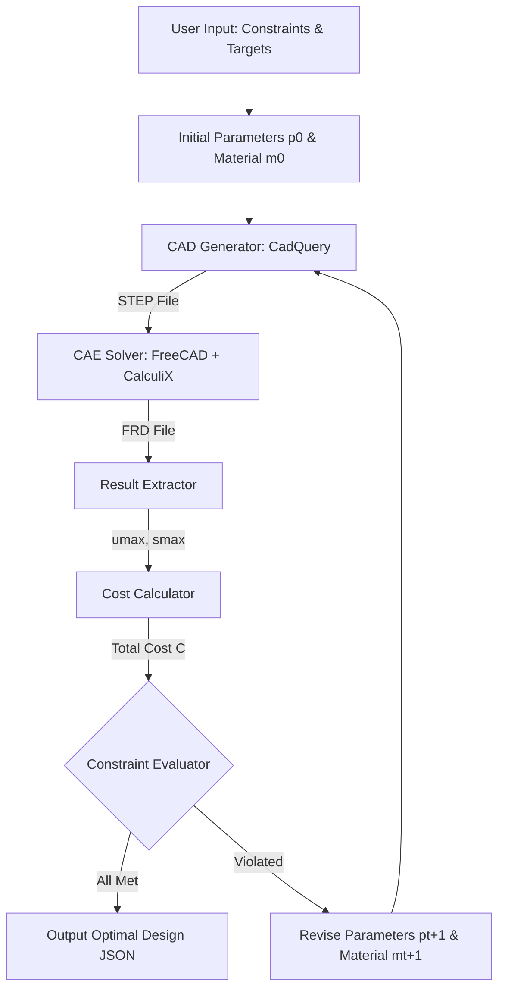

# COSMO-Agent CAD-CAE Orchestration

This skill implements the **Closed-loop Optimization, Simulation, and Modeling Orchestration (COSMO-Agent)** framework based on the *arXiv:2604.05547* research paper [1]. It provides a structured playbook for automating iterative, constraint-driven engineering design cycles.

---

## 1. General Framework Architecture

The COSMO-Agent workflow resolves the "CAD-CAE semantic gap" by casting the design-simulate-evaluate cycle into an iterative loop controlled by the agent [1].

---

## 2. Core Tool Orchestration

The framework relies on four modular tools to execute the loop. Any implementation of this workflow must expose or automate these interfaces:

### Tool 1: CAD Generator (CadQuery)
*   **Inputs**: Part Category ($c$), Geometric Parameters ($p$) [1].
*   **Outputs**: Executable solid geometry file (STEP format) and geometry metadata (e.g., face anchor points) [1].
*   **Implementation Rule**: Use **CadQuery** to generate parametric designs. The face anchor points are crucial to ensure that loads and constraints remain consistently bound to the correct faces as dimensions shift [1].

### Tool 2: CAE Solver (FreeCAD + CalculiX)
*   **Inputs**: Geometry file path (STEP), Material properties (Young's modulus $E$, Poisson's ratio $\nu$, density $\rho$), and Boundary conditions (applied loads, fixed constraints) [1].
*   **Outputs**: Simulation result file (FRD format) and solver logs [1].
*   **Boundary Mapping Rule**: Anchor points $q$ from geometry metadata are matched to candidate target faces $F_j$ by calculating point-to-face distance:
    $$\text{dist}(q, F_j) \le \varepsilon$$
    Faces within tolerance $\varepsilon$ are selected as load or constraint faces to maintain consistent boundary condition locations [1].

### Tool 3: Result Extractor
*   **Inputs**: Simulation result file (FRD) [1].
*   **Outputs**: Maximum displacement $u_{\text{max}}$ and maximum von Mises stress $\sigma_{\text{max}}$ [1].
*   **Formulas**:
    *   *Maximum Displacement*:
        $$u_{\text{max}} = \max_i \|u_i\|_2$$
    *   *Maximum von Mises stress*:
        $$\sigma_v = \sqrt{\frac{1}{2} \left[ (\sigma_{xx} - \sigma_{yy})^2 + (\sigma_{yy} - \sigma_{zz})^2 + (\sigma_{zz} - \sigma_{xx})^2 \right] + 3(\tau_{xy}^2 + \tau_{yz}^2 + \tau_{zx}^2)}$$
        $$\sigma_{\text{max}} = \max_i \sigma_{v, i}$$

### Tool 4: Cost Calculator
*   **Inputs**: Geometry file path, Material density $\rho(m)$, Unit mass price $\pi(m)$ [1].
*   **Outputs**: Total material cost $C$ [1].
*   **Formula**:
    $$C = \rho(m) \cdot V_{\text{solid}} \cdot \pi(m)$$

---

## 3. Recommended Free & Open-Source Toolchain (Aesthetics & Automation)

To build a fully automated, cost-free engineering loop, we use the following Python-orchestrated open-source tools:

| Stage | Selected Free Tool | Function & Integration |
| :--- | :--- | :--- |
| **CAD (Geometry)** | **CadQuery** or **Build123d** [2] | Python-first parametric modeling engine. It generates 3D geometries as STEP files using standard python variables [2]. |
| **Meshing** | **Gmsh** (via Python API) [2] | High-performance 3D finite element mesh generator. Takes STEP geometry and outputs a solver-compatible mesh (`.inp` or `.msh`) [2]. |
| **Solver (CAE)** | **CalculiX (ccx)** [3] | High-performance finite element solver. Solves structural displacement and stress equations using standard input files [3]. |
| **Post-Processing** | **ParaView** (via `ccx2paraview`) [2] | Industry-standard open-source 3D visualization. Renders color stress contours and displacement animations. |

---

## 4. Iterative Optimization Loop & Constraint Checking

At each iteration round $t$, the agent must evaluate the current state against three coupled engineering constraints:

1.  **Stiffness Constraint**: Maximum displacement must not exceed threshold:
    $$u_{\text{max}}^{(t)} \le \delta$$
2.  **Strength Constraint**: Maximum equivalent stress must not exceed the material's allowable stress:
    $$\sigma_{\text{max}}^{(t)} \le \sigma_{\text{allow}}(m_t)$$
3.  **Cost Constraint**: Total material cost must not exceed the budget:
    $$C^{(t)} \le \kappa$$

### Step-by-Step Execution Playbook

1.  **Initialize**: Read requirements ($\delta$, $\kappa$, material library $\mathcal{M}$) and start with initial parameters $p_0$ and material $m_0$ [1].
2.  **Generate & Solve**: Call CAD Generator $\rightarrow$ CAE Solver $\rightarrow$ Result Extractor $\rightarrow$ Cost Calculator [1].
3.  **Evaluate**:
    *   Check if all three constraints are satisfied.
    *   If **satisfied**, terminate and output the optimal parameters and material as a structured JSON object [1].
    *   If **violated**, record the current state and metrics in memory, propose updated parameters $(p_{t+1}, m_{t+1})$ based on the numerical feedback, and loop back to Step 2 [1].
4.  **Budget Exhaustion**: If the maximum iteration limit (e.g., 15 turns) is reached without satisfying all constraints, output the best candidate design found and detail the unresolved constraints.

---

## References
*   [1] *Deng et al. (2026). COSMO-Agent: Tool-Augmented Agent for Closed-loop Optimization, Simulation, and Modeling Orchestration.* arXiv:2604.05547.
*   [2] *FastPreci - Open-Source CAD/CAE Automation Pipelines.* (Technical benchmarks for CadQuery and Gmsh integrations).
*   [3] *CalculiX Solver Documentation.* (CalculiX CrunchiX manual).
