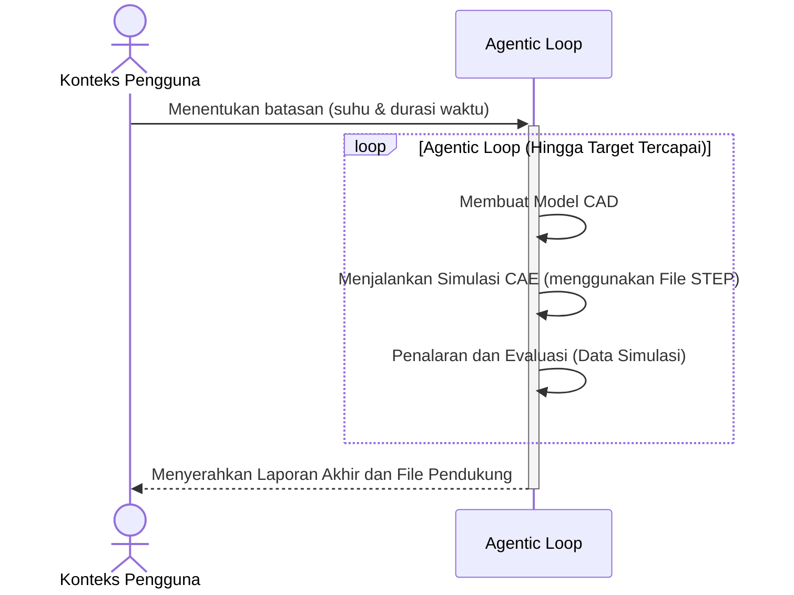

# Kerangka Presentasi: Automated Generative Design using Agentic Loop

> **Total Slide:** 7  
> **Audiens:** Campuran (Akademisi + Pemangku kepentingan industri)  
> **Pesan Utama:** Memperkenalkan metodologi agentic loop DAN menunjukkan bahwa metodologi tersebut menghasilkan hasil rekayasa yang valid

---

## Slide 1 — Halaman Judul

**Judul:** Automated Generative Design using Agentic Loop

**Konten yang disarankan:**
- Subjudul: Optimasi CAD-CAE Closed-Loop untuk Desain Enclosure Downhole Tool
- Nama penulis dan afiliasi (UGM / PHE Upstream Innovation)
- Tanggal
- Logo proyek atau logo institusi

---

## Slide 2 — Pernyataan Masalah

**Judul:** Mengapa Perlu Desain Otomatis?

**Poin-poin utama:**
- Proyek Pertacoustic memerlukan perancangan enclosure downhole untuk alat Spectral Noise Logging (SNL)
- Lingkungan operasi sangat ekstrem: **suhu bottomhole 150°C**, **tekanan 10.000 PSI**, layanan asam (H₂S/CO₂)
- Alur kerja CAD-CAE tradisional bersifat **manual dan iteratif** — insinyur mendesain, menjalankan simulasi, memeriksa hasil, mendesain ulang, dan mengulangi
- Siklus manual ini lambat, rentan terhadap kesalahan manusia, dan membatasi eksplorasi ruang desain
- **Tujuan:** Mengotomatisasi siklus desain-simulasi-evaluasi agar sistem dapat konvergen pada desain yang valid secara otonom

**Saran visual:**
- Diagram sederhana yang menunjukkan siklus desain **manual** (desainer → CAD → FEA → cek → desain ulang → ulangi) dengan label merah "lambat & manual"
- Atau foto/ilustrasi lingkungan downhole tool untuk memberikan konteks fisik

---

## Slide 3 — Apa itu Agentic Loop?

**Judul:** Apa itu Agentic Loop?

**Poin-poin utama:**
- **Agentic loop** adalah arsitektur AI di mana agen otonom mengikuti siklus berulang: **Reason → Act → Observe → Evaluate**
- Berbeda dengan chatbot sederhana (satu prompt → satu respons), sistem agentik **beriterasi secara otonom** hingga tujuan tercapai
- Komponen utama:
  - **Reasoning Engine** — LLM yang merencanakan tindakan selanjutnya
  - **Tools** — CAD generator, FEA solver, result extractor
  - **Feedback Loop** — Hasil simulasi diumpanbalikkan ke iterasi desain berikutnya
  - **Stop Condition** — Loop berhenti ketika batasan desain terpenuhi (misal, suhu maks ≤ target)
- Ini bukan generative design tradisional (topology optimization); ini adalah **optimasi parametrik berbasis tujuan** yang dipandu oleh penalaran AI

**Saran visual:**
- Diagram melingkar yang menunjukkan 4 fase: Reason → Act → Observe → Evaluate → (kembali ke awal)
- Atau tabel perbandingan: **Desain Tradisional** vs. **Desain Agentic Loop**

---

## Slide 4 — Cara Kerja Agentic Loop

**Judul:** Cara Kerja Agentic Loop

**Konten:** Diagram sekuens dari [workflow_flowchart.md](file:///c:/Users/ASUS/Desktop/project/antigravity-pertacoustic/presentation/workflow_flowchart.md)

**Poin-poin pembahasan:**
- Pengguna hanya memberikan **batasan** (target suhu, durasi paparan)
- Agen secara otonom:
  1. **Membuat** model CAD parametrik (geometri, ketebalan dinding, material)
  2. **Menjalankan** simulasi FEA termal (solver CalculiX)
  3. **Mengevaluasi** data simulasi (suhu maksimum pada node kritis)
- Jika target belum tercapai, agen **mengubah parameter desain** dan melakukan loop kembali
- Ketika target terpenuhi, agen **menyerahkan** laporan akhir, file CAD, plot suhu, dan visualisasi 3D

---

## Slide 5 — Hasil Analisis Termal

**Judul:** Hasil Analisis Termal

**Poin-poin utama:**
- Tampilkan **plot distribusi suhu** dari simulasi FEA
  - Sumbu-X: waktu atau posisi, Sumbu-Y: suhu (°C)
  - Sorot suhu maksimum pada komponen kritis (sensor, elektronik)
- Tampilkan **video visualisasi termal 3D** (di-render dari hasil CalculiX)
  - Gradien suhu dengan pemetaan warna pada penampang enclosure
- Soroti hasil utama:
  - Suhu maksimum yang tercapai di lokasi sensor: **XX°C**
  - Apakah memenuhi batasan desain (≤ suhu target)
  - Jumlah iterasi yang dibutuhkan agentic loop untuk konvergen

**Saran visual:**
- Sisi kiri: Plot suhu (gambar statis)
- Sisi kanan: Screenshot dari animasi termal 3D (atau sisipkan video jika format presentasi mendukung)

---

## Slide 6 — Rekomendasi Desain Enclosure

**Judul:** Desain Enclosure

**Poin-poin utama:**
- Berdasarkan analisis termal, pemilihan material dapat menggunakan **BUTH (Buna-N / Nitrile)** yang dirating untuk **70°C**
- Hal ini dimungkinkan karena agentic loop menunjukkan bahwa desain enclosure menjaga suhu internal di bawah ambang batas 70°C
- Ini **menyederhanakan desain casing** — tidak perlu material suhu tinggi eksotis (misal, PEEK, Viton) yang lebih mahal dan lebih sulit diproduksi
- Tampilkan desain enclosure akhir:
  - Rendering CAD atau penampang
  - Dimensi utama (OD: 43 mm, chassis internal: 25,4 mm)
  - Keterangan material

**Saran visual:**
- Penampang CAD atau rendering 3D dari enclosure akhir
- Kotak keterangan: "Material: BUTH @ 70°C → Desain lebih sederhana, biaya lebih rendah"

---

## Slide 7 — Ringkasan & Langkah Selanjutnya

**Judul:** Ringkasan & Langkah Selanjutnya

**Ringkasan (apa yang telah dicapai):**
- Mengimplementasikan **agentic loop** yang secara otonom menghasilkan dan memvalidasi desain enclosure downhole
- Sistem menutup loop antara **CAD generation → simulasi FEA → evaluasi AI**
- Analisis termal mengonfirmasi bahwa desain memenuhi batasan operasional, memungkinkan **pilihan material yang lebih sederhana dan hemat biaya**

**Langkah Selanjutnya (sesuaikan dengan roadmap aktual Anda):**
- Validasi dengan pengujian prototipe fisik
- Perluas agentic loop untuk mencakup **analisis struktural/tekanan** (tidak hanya termal)
- Integrasikan parameter desain tambahan (acoustic window, pressure compensator)
- Publikasi temuan / presentasi di konferensi

**Saran visual:**
- Daftar poin ringkas (tidak lebih dari 3–4 per bagian)
- Opsional: grafik timeline atau roadmap untuk langkah selanjutnya

---

## Catatan untuk Pembuatan PowerPoint

- **Dimensi slide:** Gunakan format layar lebar 16:9
- **Rekomendasi font:** Gunakan font sans-serif yang bersih (misal, Inter, Outfit, atau Calibri)
- **Saran palet warna:** Latar belakang navy/teal gelap dengan teks putih dan aksen oranye/amber untuk sorotan
- **Diagram:** Diagram mermaid dalam kerangka ini dapat diekspor sebagai gambar menggunakan mermaid.live atau di-render langsung di tools yang mendukung
- **Video:** Untuk Slide 5, sisipkan animasi termal 3D sebagai video MP4 di PowerPoint (Insert → Video → Video on My PC)
