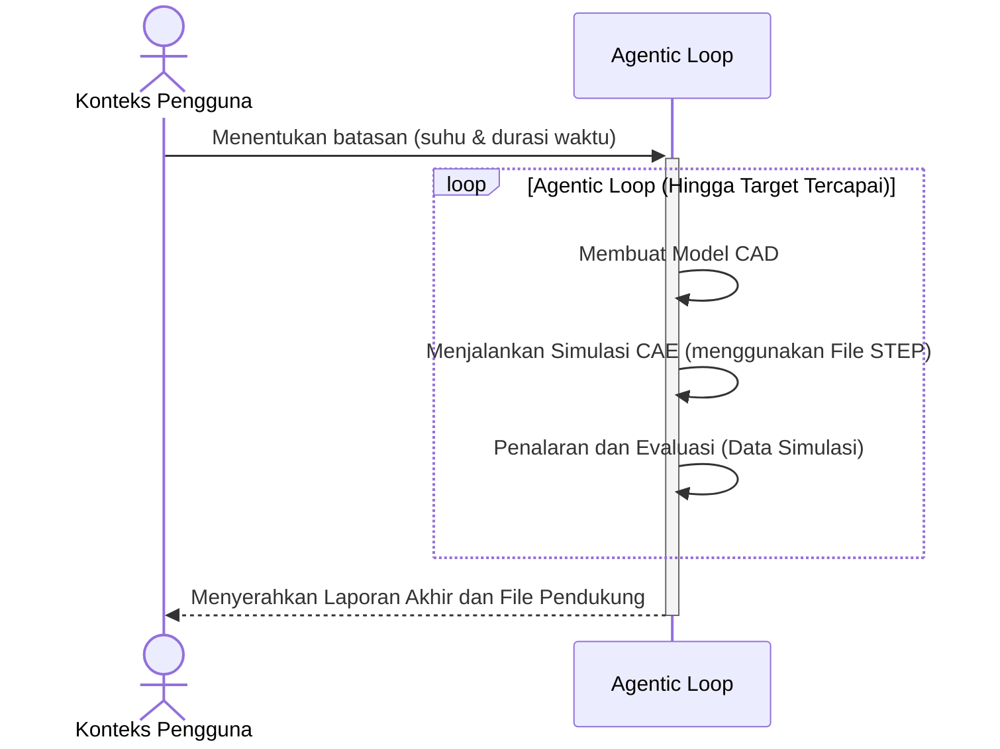

# Kerangka Presentasi: Automated Generative Design using Agentic Loop

> **Total Slide:** 6  
> **Audiens:** Campuran (Akademisi + Pemangku kepentingan industri)  
> **Pesan Utama:** Memperkenalkan metodologi agentic loop DAN menunjukkan bahwa metodologi tersebut menghasilkan hasil rekayasa yang valid

---

## Slide 1 — Halaman Judul

**Judul:** Automated Generative Design using Agentic Loop

**Konten yang disarankan:**
- Subjudul: Optimasi CAD-CAE Closed-Loop untuk Desain Enclosure Downhole Tool
- Nama penulis dan afiliasi (UGM / PHE Upstream Innovation)
- Tanggal
- Logo proyek atau logo institusi

---

## Slide 2 — Pernyataan Masalah

**Judul:** Mengapa Perlu Desain Otomatis?

**Poin-poin utama:**
- Proyek Pertacoustic memerlukan perancangan enclosure downhole untuk alat Spectral Noise Logging (SNL)
- Lingkungan operasi sangat ekstrem: **suhu bottomhole 150°C**, **tekanan 10.000 PSI**, layanan asam (H₂S/CO₂)
- Alur kerja CAD-CAE tradisional bersifat **manual dan iteratif** — insinyur mendesain, menjalankan simulasi, memeriksa hasil, mendesain ulang, dan mengulangi
- Siklus manual ini lambat, rentan terhadap kesalahan manusia, dan membatasi eksplorasi ruang desain
- **Tujuan:** Mengotomatisasi siklus desain-simulasi-evaluasi agar sistem dapat konvergen pada desain yang valid secara otonom

**Saran visual:**
- Diagram sederhana yang menunjukkan siklus desain **manual** (desainer → CAD → FEA → cek → desain ulang → ulangi) dengan label merah "lambat & manual"
- Atau foto/ilustrasi lingkungan downhole tool untuk memberikan konteks fisik

---

## Slide 3 — Apa itu Agentic Loop?

**Judul:** Apa itu Agentic Loop?

**Poin-poin utama:**
- **Agentic loop** adalah arsitektur AI di mana agen otonom mengikuti siklus berulang: **Reason → Act → Observe → Evaluate**
- Berbeda dengan chatbot sederhana (satu prompt → satu respons), sistem agentik **beriterasi secara otonom** hingga tujuan tercapai
- Komponen utama:
  - **Reasoning Engine** — LLM yang merencanakan tindakan selanjutnya
  - **Tools** — CAD generator, FEA solver, result extractor
  - **Feedback Loop** — Hasil simulasi diumpanbalikkan ke iterasi desain berikutnya
  - **Stop Condition** — Loop berhenti ketika batasan desain terpenuhi (misal, suhu maks ≤ target)
- Ini bukan generative design tradisional (topology optimization); ini adalah **optimasi parametrik berbasis tujuan** yang dipandu oleh penalaran AI

**Saran visual:**
- Diagram melingkar yang menunjukkan 4 fase: Reason → Act → Observe → Evaluate → (kembali ke awal)
- Atau tabel perbandingan: **Desain Tradisional** vs. **Desain Agentic Loop**

---

## Slide 4 — Cara Kerja Agentic Loop

**Judul:** Cara Kerja Agentic Loop

**Konten:** Diagram sekuens dari [workflow_flowchart.md](file:///c:/Users/ASUS/Desktop/project/antigravity-pertacoustic/presentation/workflow_flowchart.md)

**Poin-poin pembahasan:**
- Pengguna hanya memberikan **batasan** (target suhu, durasi paparan)
- Agen secara otonom:
  1. **Membuat** model CAD parametrik (geometri, ketebalan dinding, material)
  2. **Menjalankan** simulasi FEA termal (solver CalculiX)
  3. **Mengevaluasi** data simulasi (suhu maksimum pada node kritis)
- Jika target belum tercapai, agen **mengubah parameter desain** dan melakukan loop kembali
- Ketika target terpenuhi, agen **menyerahkan** laporan akhir, file CAD, plot suhu, dan visualisasi 3D

---

## Slide 5 — Hasil Analisis Termal

**Judul:** Hasil Analisis Termal

**Poin-poin utama:**
- **Plot Konvergensi Suhu:** Menampilkan riwayat simulasi dari 6 iterasi (`temperature_plot.png`). Terlihat jelas suhu berhasil ditekan dari 150°C menjadi 68.36°C.
- **Visualisasi Termal 3D:** Animasi distribusi panas pada enclosure (`thermal_anim_final.mp4`).
- **Hasil Akhir:** Suhu maksimum internal yang tercapai adalah **68.36°C** (memenuhi batas maksimal 70°C).
- Agentic loop membutuhkan **6 iterasi** untuk secara otonom menemukan konfigurasi ketebalan yang tepat.

**Saran visual:**
- Kiri: Sisipkan gambar `temperature_plot.png`
- Kanan: Sisipkan video animasi 3D `thermal_anim_final.mp4`

---

## Slide 6 — Kesimpulan Desain Enclosure

**Judul:** Kesimpulan & Kelayakan Desain

**Poin-poin utama:**
- Berdasarkan hasil iterasi Agentic Loop, kombinasi **Titanium (Casing Luar), Aerogel (Insulator), dan PEEK (Sasis Internal)** terbukti **sangat layak (highly viable)**.
- Desain ini berhasil menjaga suhu elektronik internal di angka **68.36°C** (di bawah batas 70°C) selama 1 jam pada suhu lingkungan ekstrem 150°C tanpa menggunakan sistem vakum.
- **Trade-off Dimensi:** Untuk mencapai isolasi termal tanpa vakum ini, ketebalan Aerogel harus dinaikkan menjadi 19 mm, yang menghasilkan **Outer Diameter (OD) akhir sebesar 70 mm**.
- **Ringkasan:** Metodologi Agentic Loop sukses mengotomatisasi penemuan desain yang valid secara fisik dalam waktu singkat.

**Saran visual:**
- Rendering CAD final dari enclosure.
- Teks penekanan (Highlight): "Suhu Aman: 68.36°C | OD Akhir: 70 mm"

---

## Catatan untuk Pembuatan PowerPoint

- **Dimensi slide:** Gunakan format layar lebar 16:9
- **Rekomendasi font:** Gunakan font sans-serif yang bersih (misal, Inter, Outfit, atau Calibri)
- **Saran palet warna:** Latar belakang navy/teal gelap dengan teks putih dan aksen oranye/amber untuk sorotan
- **Diagram:** Diagram mermaid dalam kerangka ini dapat diekspor sebagai gambar menggunakan mermaid.live atau di-render langsung di tools yang mendukung
- **Video:** Untuk Slide 5, sisipkan animasi termal 3D sebagai video MP4 di PowerPoint (Insert → Video → Video on My PC)
