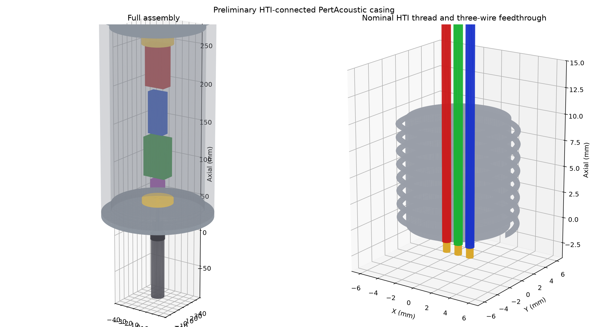
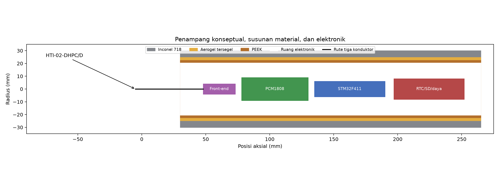
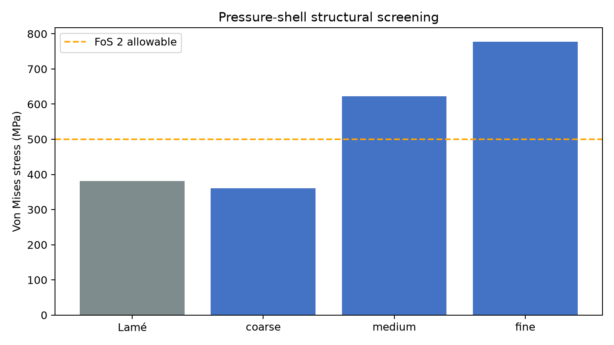
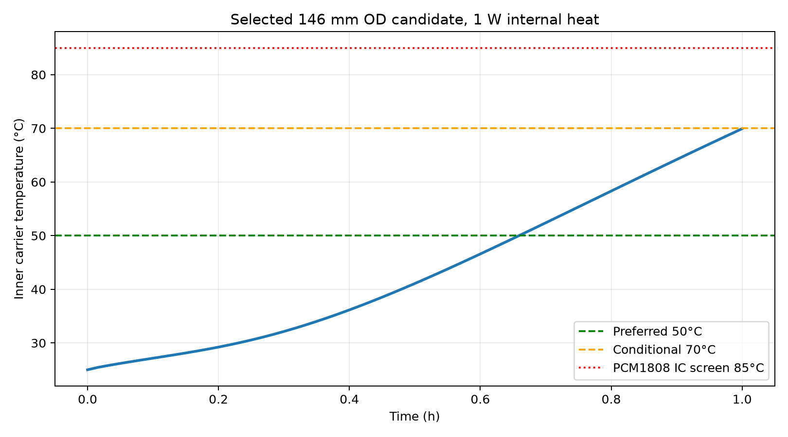
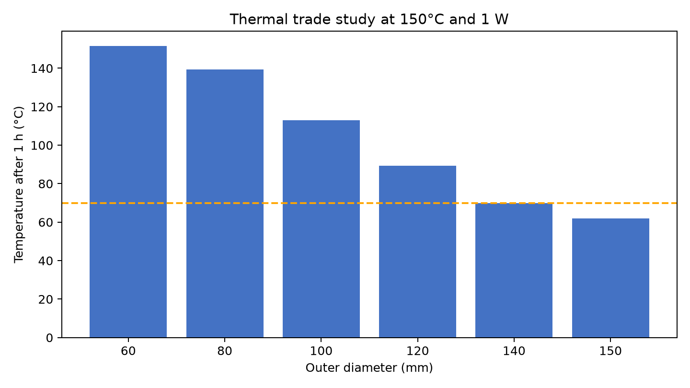

# PERTACOUSTIC: Biweekly 5 report

Periode: Biweekly 5

Tanggal: 30 Juli 2026

Status: preliminary engineering. Current design status: FAIL.

Dokumen ini mencatat hasil desain dan simulation screening. Hasilnya belum dapat dipakai sebagai manufacturing drawing, pressure rating, atau seal qualification.

## 1. Rencana dan realisasi pekerjaan

Biweekly 4 mencatat progress kumulatif 20%. Pekerjaan periode ini meliputi desain casing, interface ke HTI-02-DHPC/D, electronics layout, thermal analysis, dan structural analysis. Persentase progress tidak ditambah karena bobot resmi pekerjaan belum tersedia.

## 2. Ringkasan progress

- Casing menggunakan nominal male thread `7/16-20 UNF-2A` untuk terhubung ke female thread HTI `7/16-20 UNF-2B`.
- Model CAD berisi tiga conductor paths, front analog section, PCM1808, STM32F411, dan ruang RTC/SD/power.
- Material stack tetap Inconel 718, sealed aerogel, dan PEEK. PA12/nylon hanya dipertimbangkan untuk carrier, cable guide, spacer, atau strain relief.
- Radial screening menghasilkan kandidat OD 146 mm. Closed 3D models menunjukkan bahwa kandidat ini belum memenuhi thermal dan structural criteria.

## 3. Engineering work

### 3.1 Design basis

HTI mechanical outline dipakai sebagai reference untuk thread dan envelope. Drawing tersebut bertanda "for reference only", jadi datum dan thread tolerance masih harus dikonfirmasi kepada HTI. Preamplifier mode dan pinout juga belum diketahui. Karena itu, model mempertahankan tiga conductor paths dan configurable analog front-end.

Provisional board envelopes adalah 55 x 22 x 12 mm untuk STM32F411 dan 52 x 32 x 18 mm untuk PCM1808. Dengan assembly clearance 1,5 mm, clear ID yang dipakai adalah 41 mm. Ukuran board harus diukur langsung sebelum detailed design.

Target electronics temperature adalah 50°C. Rentang 50 sampai 70°C dianggap conditional. Temperatur di atas 70°C membutuhkan redesign. PCM1808 mempunyai operating ceiling 85°C [2], tetapi angka 85°C bukan design target.

Desain dibatasi pada conventional CNC dan laboratory assembly di Laboratorium Geofisika UGM. Vacuum insulation dan added thermal-mass block tidak digunakan.

### 3.2 Mechanical concept

Front adapter terdiri dari nominal thread, shoulder, spigot, tiga cable holes, dan dua preliminary seal grooves. Thread HTI menahan sensor. Pressure seal untuk electronics housing berada pada interface yang terpisah. Groove dimensions, elastomer, backup ring, extrusion gap, dan tolerance stack belum ditetapkan.

Rear pressure endcap sudah ditambahkan ke CAD. Defeatured FEA model memakai closed Inconel vessel agar pressure bekerja pada barrel dan kedua endcaps. Thread, seal contact, dan local groove geometry belum masuk ke FEA.

### 3.3 Electronics layout and materials

Axial order pada model adalah HTI, analog front-end, PCM1808, STM32F411, lalu RTC/SD/power. Aerogel berada di dalam Inconel housing dan tidak bersentuhan langsung dengan well fluid.

Inconel properties berasal dari Special Metals [3]. Nilai strength tetap bergantung pada product form dan heat treatment. PEEK memakai Victrex 450G data dengan heat capacity sebagai screening assumption [4]. Pyrogel HPS memakai nominal density 200 kg/m³ dan conductivity 0,024 W/mK pada mean temperature 100°C [5]. Specific heat aerogel 1.000 J/kgK masih merupakan assumption dan perlu dikonfirmasi untuk material yang dibeli.

### 3.4 Geometry and structural screening

| OD (mm) | Fit | Inconel wall (mm) | Aerogel (mm) | Structural status | Note |
|---:|---|---:|---:|---|---|
| 43 | no | - | - | - | Insufficient radial space for 41 mm clear ID, PEEK, pressure wall, and aerogel. |
| 50 | no | - | - | - | Insufficient radial space for 41 mm clear ID, PEEK, pressure wall, and aerogel. |
| 60 | yes | 5.25 | 2.25 | PASS | analytical geometry/wall screen only |
| 146 | yes | 12.5 | 38.0 | FAIL | Closed 3D thermal/structural validation failed. |

Radial screening memilih OD 146 mm dengan wall 12.5 mm, aerogel 38.0 mm, PEEK 2.0 mm, dan clear ID 41 mm. Lamé calculation memberi equivalent stress 381.36 MPa dan yield safety factor 2.62. Long-cylinder equation memberi buckling factor 2.11. Kedua calculation hanya mewakili cylindrical wall.

Closed-vessel FEA belum mesh-converged. Coarse, medium, dan fine stress adalah 360.92, 622.51, dan 778.05 MPa. Displacement berubah dari 1.761 menjadi 3.297 mm. Medium-to-fine changes masih 19.99% untuk stress dan 20.20% untuk displacement.

Thermo-mechanical load masih memakai radial temperature profile, bukan direct mapping dari closed 3D thermal result. Karena itu, static stress dan displacement dipakai sebagai screening trend. Buckling analysis tidak memakai thermal load dan tetap menjadi independent failure check.

Buckling factors turun dari 1.76 pada coarse mesh menjadi 0.88 pada fine mesh. Medium-to-fine change adalah 41.19%. Semua mesh berada di bawah acceptance factor 2. Karena hasil belum converged, nilai fine mesh tidak dianggap sebagai exact design stress. Kesimpulan FAIL tetap berlaku karena buckling margin tidak tercapai dan trend belum stabil.

Thread retention calculation memberi safety factor 6.58. Calculation ini masih nominal dan belum menggantikan thread tolerance atau seal design.

### 3.5 Thermal analysis

Radial transient model memakai initial temperature 25°C, external surface 150°C, exposure 1 hour, dan internal heat 0, 1, atau 2 W. Pada 1 W, kandidat OD 146 mm menghasilkan 69.94°C. Hasil ini hanya berlaku untuk radial heat flow dengan adiabatic ends.

Closed 3D CalculiX model memasukkan front and rear Inconel endcaps, axial aerogel buffers, dan total internal heat 1 W. Fine mesh menghasilkan component-zone temperatures berikut.

| Model input check | Value |
|---|---|
| Initial temperature | 25°C |
| External boundary | 150°C on barrel and both end faces |
| Internal heat | 1 W total nodal CFLUX |
| Exposure time | 3600 s (1 hour) |
| Thermal medium-to-fine change | 0.0007% |

| Electronics zone | Maximum inner-boundary temperature after 1 hour (°C) | Screening |
|---|---:|---|
| Analog front-end | 140.43 | redesign |
| PCM1808 | 92.02 | redesign; above the 85°C IC ceiling |
| STM32F411 | 71.77 | redesign |
| RTC/SD/power | 112.02 | redesign |

Maximum cavity-boundary temperature adalah 140.43°C pada analog front-end zone, tepat setelah front axial aerogel buffer setebal 6 mm. PCM1808 zone boundary mencapai 92.02°C, di atas operating ceiling 85°C. STM32F411 zone boundary mencapai 71.77°C, sedikit di atas 70°C screening limit. Angka ini bukan chip junction temperature karena boards belum dimodelkan sebagai solids.

Perbedaan antara radial model dan closed 3D model berasal dari heat flow melalui endcaps dan axial sections. Menambah radial aerogel membantu bagian tengah housing, tetapi tidak menambah jarak thermal path di depan atau belakang. Karena itu, memperbesar OD saja tidak menyelesaikan temperatur di end zones.

Simple resistance cross-check memberi front axial resistance sekitar 54,5 K/W untuk aerogel dan PEEK dalam parallel path. Pada initial temperature difference 125 K, heat leak awalnya sekitar 2,29 W. Rear path sekitar 186,3 K/W atau 0,67 W. Nilai ini memakai ideal contact, tetapi cukup untuk menunjukkan bahwa axial heat leak sebanding dengan, bahkan lebih besar dari, internal heat 1 W.

Thermal mesh convergence memenuhi kriteria. Medium-to-fine change adalah 0.0007%. External surface langsung ditahan pada 150°C, sehingga model ini conservative untuk transient heating. Model belum memakai measured electronics heat capacity, contact resistance, cable conduction, atau aerogel compression data. Nilai temperatur harus dibaca sebagai screening result, bukan predicted field-test temperature.

### 3.6 Current result

Current design status adalah FAIL.

Radial wall calculation lulus, tetapi closed 3D thermal model gagal pada PCM1808 dan end zones. Closed-vessel structural model juga belum memenuhi buckling factor dan mesh convergence criteria. Memperbesar radial aerogel tanpa mengubah endcap geometry atau electronics position tidak cukup.

## 4. Next work

- Measure the actual STM32F411 and PCM1808 boards, including connectors and headers.
- Measure electronics power during logging and standby conditions.
- Move temperature-sensitive electronics farther from both endcaps and increase axial insulation length.
- Redesign the flat end closures, then repeat static and buckling convergence studies.
- Select the actual aerogel, PEEK, Inconel heat treatment, and seal materials that can be purchased.
- Complete seal groove calculation and manufacturing tolerance stack.
- Validate a simple Inconel/aerogel/PEEK coupon in an oven or hot bath before relying on the 3D thermal model.

## 5. References

1. [High Tech Inc., HTI-02-DHPC/D](https://www.hightechincusa.com/products/hydrophones/hti02dhpc.html)
2. [Texas Instruments, PCM1808](https://www.ti.com/product/PCM1808)
3. [Special Metals, INCONEL Alloy 718 Technical Bulletin](https://www.specialmetals.com/documents/technical-bulletins/inconel/inconel-alloy-718.pdf)
4. [Victrex, PEEK 450G Technical Data Sheet](https://images.victrex.com/-/media/downloads/datasheets/victrex_tds_450g.pdf)
5. [Aspen Aerogels, Pyrogel HPS Product Data Sheet](https://www.aerogel.com/wp-content/uploads/2021/06/Pyrogel-HPS-Datasheet-English.pdf)
6. HTI-02-DHPC/D Mechanical Outline 02-001-25-00-00, supplier document marked "for reference only".
